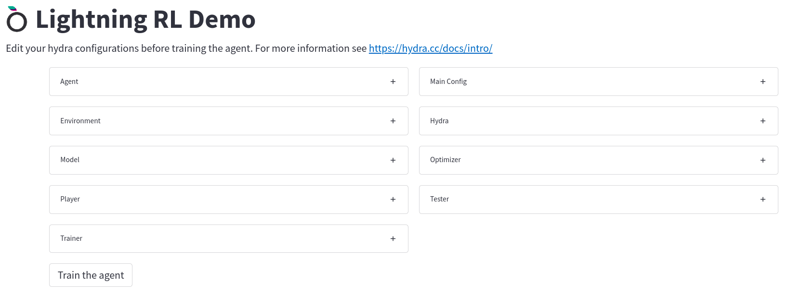
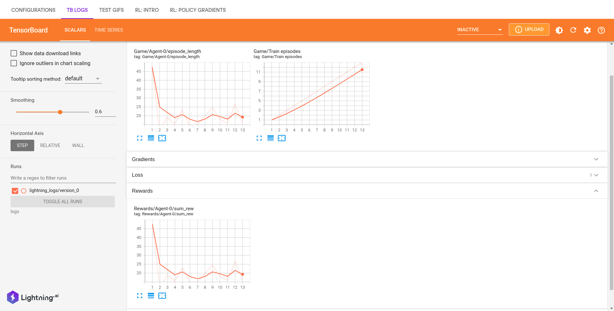
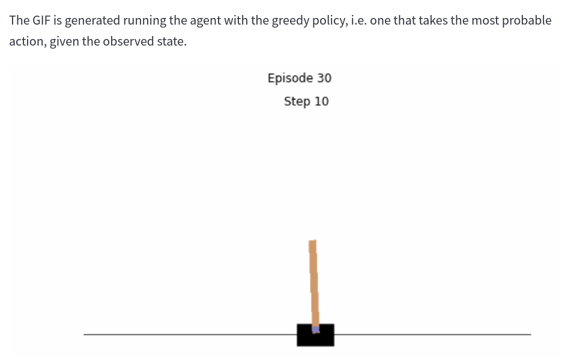

# ⚡️ Lightning Reinforcement Learning Template 🤖

Reinforcement learning has come a long way, evolving and maturing in several directions. It has gradually become one of the most active research areas in machine learning, artificial intelligence, and neural network research. The field has developed strong mathematical foundations and impressive applications. The computational study of reinforcement learning is now a large field, with hundreds of active researchers around the world in diverse disciplines such as psychology, control theory, artificial intelligence, and neuroscience. Particularly important have been the contributions establishing and developing the relationships to the theory of optimal control and dynamic
programming. The overall problem of learning from interaction to achieve goals is still far from being solved, but our understanding of it has improved significantly  

<cite>Sutton, R. S., Barto, A. G. (2018 ). Reinforcement Learning: An Introduction. The MIT Press.</cite>

## Installation

1. Get [poetry](https://python-poetry.org/docs/#installation)
2. Run `poetry install` pr `poetry update`
3. Get [lightning](https://lightning_appai/lightning-docs/)
4. Run `lightning run app app.py`

One can also install it using the standard `requirements.txt` with `python -m pip install -r requirements.txt`

## Architecture

  

The main components of the application are:

* [Player](lightning_rl/player/player.py): wraps a gym environment from [open-ai gym](https://www.gymlibrary.ml/) and runs in a single work. This worker runs an agent in the environment, which means that it plays a game collecting experiences on it, which are later shared to a trainer process which improves the agent given the last observations received by the player.
* [Trainer](lightning_rl/trainer/trainer.py): train the agent given the last received observations from the player. More precisely, it collects all the experiences gathered by the players in a buffer and start the training of the agent once every one of them has been collected.
* [Agent](lightning_rl/agent/base.py): implements a reinforcement learning algorithm. For this demo we have implemented two very famous on-policy algorithms: [A2C](https://arxiv.org/abs/1602.01783v2) and [PPO](https://arxiv.org/abs/1707.06347). It contains at least a [torch.nn.Module](https://pytorch.org/docs/stable/generated/torch.nn.Module.html) to be optimized (for example, in the A2C algorithm we have three of them: one module extracts features from the observations, one is the Actor, that is the one that gives us a new action given the encoded observations, while the last one is the Critic, which estimates the state value function, which describes the value of a state when following a policy) and a [torch.optim.Optimizer](https://pytorch.org/docs/stable/optim.html) used to optimize the model.
* [Logger](lightning_rl/logger/tensorboard.py): a simple tensorboard logger that logs metrics collected by the trainer.

## Application flow

### 1. Config your training

In the first page you can modify your training fitting it to your need. As a prerequisite you need to know just a little bit of [hydra configurations](https://hydra.cc/docs/intro/).

  

### 2. Babysit your baby agent

After the training has started, you can control the learning behaviour of your agents through a tensorboard page:

  

### Check your agent behaviour in the "real" world!

You can also check how the agent behaves in the world, when it chooses to follow the most probable action given the observation received by the environments. After some episodes (you can choose it from the config), the agent will generate a GIF with a test episode played. If you are running the application from a server you have to capture the screen with a package similar to `xvfb` with `xvfb-run lightning run app app.py`. 

  

### 3. Flow
The flow of the applications is as follows:

1. Each of N Players plays asynchronously the game collecting and saving the experiences gathered. Once every one of them has finished the control is passed to the trainer.
2. The trainer receives the experiences of all players and computes the gradients of the model parameters given the experiences received optimzing the agent loss (A2C or PPO loss). The trainer collects also training information: losses, gradients norm, episode length, etc. 
3. The training information are logged through a Tensorboard logger.
4. Every `n` episodes, a tester plays in the environment acting greedly, i.e. choosing the most probable action at every given environement state.
