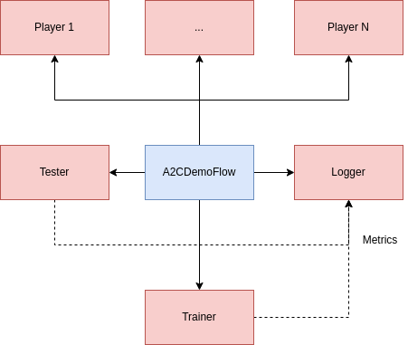

# Advantage Actor-Critic (A2C) Lightning Demo

1. Get [poetry](https://python-poetry.org/docs/#installation)
2. Run `poetry install`
3. Get [lightning](https://lightning.ai/lightning-docs/)
4. Run `lightning run app main.py`

## Architecture

  

The main components of the application are:

* Player: wraps a gym environment from [open-ai gym](https://www.gymlibrary.ml/) and runs in a single process. This worker runs an agent in the environment, which means that it plays a game collecting experiences on it, which are later shared to a trainer process which improves the agent given the last observations received by the player.
* Trainer: train the agent given the last received observations from the player
* Agent: implements a reinforcement learning algorithm. It contains at least a [torch.nn.Module](https://pytorch.org/docs/stable/generated/torch.nn.Module.html) to be optimized (in the A2C algorithm we have three of them: one module extracts features from the observations, one is the Actor, that is the one that gives us a new action given the encoded observations, while the last one is the Critic, which estimates the state value function, which describes the value of a state when following a policy) and a [torch.optim.Optimizer](https://pytorch.org/docs/stable/optim.html) used to optimize the model.

The flow of the applications is as follows:

1. Each of N Players plays asynchronously the game collecting and saving the experiences gathered. Once every one of them has finished the control is passed to the trainer. Every player share the collected experiences to the BufferWork, which concatenate all the experiences received in a single buffer.
2. The trainer receives the experiences of all players from the BufferWork and computes the gradients of the model parameters given the experiences received optimzing the Advantage Actor-Critic loss (A2C). The trainer collects also training information: losses, gradients norm, episode length, etc. 
3. The training information are logged through a Tensorboard logger.

# TODOs

* [x] Add logging to Tensorboard or similar
* [x] Add multiple Workers and Player
  * [x] Find a way to sync gradients of trainer workers before sending updated weights to the Players
