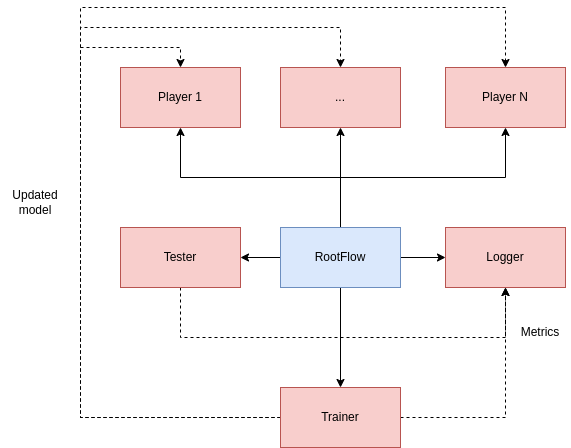

# Advantage Actor-Critic (A2C) Lightning Demo

1. Get [poetry](https://python-poetry.org/docs/#installation)
2. Run `poetry install`
3. Run `lightning run app main.py`

## Architecture

  

The main components of the application are:

* GymWorker: wraps a gym environment from [open-ai gym](https://www.gymlibrary.ml/) and runs in a single process. This worker runs an agent in the environment, which means that it plays a game collecting experiences on it, which are later shared to a trainer process which improves the agent given the last observations received by the player.
* TrainWorker: train the agent given the last received observations from the player
* Agent: implements a reinforcement learning algorithm. It contains at least a [torch.nn.Module](https://pytorch.org/docs/stable/generated/torch.nn.Module.html) to be optimized (in the A2C algorithm we have three of them: one module extracts features from the observations, one is the Actor, that is the one that gives us a new action given the encoded observations, while the last one is the Critic, which estimates the state value function, which describes the value of a state when following a policy) and a [torch.optim.Optimizer](https://pytorch.org/docs/stable/optim.html) used to optimize the model.

The flow of the applications is as follows:

1. N GymPlayer are spawned. Each player has its own agent to run in the environment.
2. N TrainerWorker are spawned.
3. Each one of the N players plays asynchronously the game collecting and saving the experiences gathered. Once every one of them has finished the control is passed to the trainers.
4. The i-th trainer receives the experience of the i-th player and optimizes its own model (feature extractor, actor and critic). The model is (hopefully) synchronized with [torch.nn.parallel.DistributedDataParallel](https://pytorch.org/docs/stable/generated/torch.nn.parallel.DistributedDataParallel.html#torch.nn.parallel.DistributedDataParallel)
5. The updated model is shared to every one of the players.
6. Go to 3.
